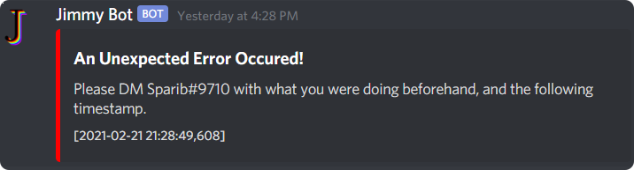

# Jimmy
Jimmy is a Discord bot created for Plackart Peak

## Handlers
Everything is done through handlers. When a message is received, handler. When config files need to be read/written,
handler. When a command is called, handler. When an error happens, handler. Even just for logging things, handler.

### Error Handler
When any error occurs, the error handler is called to action.

### Config Handler
The config handler saves all server-specific data in an XML to allow persistence of configurations through bot up-times.

## Commands
When writing commands in javascript using discord.js, I really enjoyed the way it handled multiple commands, putting
each into a new file. That made me come up with the way I handle commands now. Each command file is saved in the
`commands` package and extending the `Command` class, allowing the command to be called with a simple
`command.execute()` from anywhere, and allowing the dynamically-updating help menu to get the name, description, and
callers of the command.